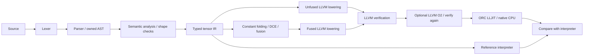

# TensorForge

[](https://github.com/ratatall/TensorForge/actions/workflows/linux.yml)

A small C++20 compiler for statically shaped `f32` tensor expressions. It parses a custom language, checks shapes, builds a visible tensor IR, optimizes it, and executes real native code through LLVM ORC JIT.

```text
input activations: tensor<32,128>;
input bias: tensor<128>;
return relu(activations + bias);
```

## At a glance

- Complete **C++20 frontend → typed tensor IR → LLVM → ORC JIT** pipeline.
- Static rank-1 through rank-8 tensors with NumPy-style trailing-dimension broadcasting.
- **Constant folding, dead-code elimination, and elementwise fusion**, plus independently selectable LLVM O2.
- **20 CTest cases**, including **984 generated-graph differential comparisons** across four JIT configurations, plus multidimensional broadcast checks.
- **2.92×** on `relu(A * 2 + B)`, N=262,144, versus **TensorForge’s unfused JIT**, with LLVM middle-end passes off; eliminated **2 MiB** of scratch. [Measured evidence](docs/benchmarking.md).
- Validated on **macOS arm64** and **Ubuntu 24.04 x86-64** with LLVM 23, including ASan/UBSan on Linux.

```bash
scripts/build.sh Release build
build/tensorforge run examples/relu_chain.tf --opt --verify
```

`--verify` checks **interpreter and all four combinations of project passes and LLVM optimization** against each other. Run the whole demo with `scripts/demo.sh` after building. The implementation is deliberately small enough to study: no ML framework dependency, generated parser, GPU runtime, or general compiler framework.

## Why this project

TensorForge compiles statically shaped tensor expressions to native CPU code through a typed intermediate representation and LLVM. Its optimization measurements are CPU microbenchmarks, not accelerator results or comparisons with PyTorch.

## Pipeline



## Build and test

Tested locally on **macOS 15.5, arm64, Apple Clang 17.0.0, LLVM 23.1.0, CMake 4.4.3**. GitHub Actions validates Ubuntu 24.04 x86-64 with Clang/LLVM 23 in ordinary and ASan/UBSan configurations. Other LLVM major versions are rejected at configuration time. See [CI status](docs/ci.md).

### macOS

Install Xcode command-line tools if no C++ compiler is available, then:

```bash
brew install cmake llvm
export LLVM_DIR="$("$(brew --prefix llvm)/bin/llvm-config" --cmakedir)"
cmake -S . -B build -DCMAKE_BUILD_TYPE=Release -DLLVM_DIR="$LLVM_DIR"
cmake --build build --parallel 4
ctest --test-dir build --output-on-failure
```

The build helper discovers `llvm-config` or `llvm-config-23` on PATH or in Homebrew's LLVM keg. It does not change shell configuration. Apple's system libc++ lacks float `from_chars`; numeric parsing uses a classic-locale stream instead.

### Linux

Install a C++20 compiler, CMake, and **LLVM 23 development libraries** using your distribution's package manager. On Debian/Ubuntu the package names are typically `build-essential`, `cmake`, `python3`, and a versioned `llvm-23-dev`; availability depends on the configured repositories. On Fedora the base tools are `gcc-c++`, `cmake`, `python3`, and `llvm-devel`; confirm that the LLVM package is version 23 before building. Do not assume the distribution's default LLVM meets this requirement.

If your Debian/Ubuntu repositories lack LLVM 23, consult the [official LLVM package repository](https://apt.llvm.org/) for your distribution's setup and version selection. Its development and release package channels differ; verify `llvm-config-23 --version` before configuring.

Point CMake to the installed LLVM configuration, using `llvm-config-23` if that is its name:

```bash
cmake -S . -B build -DCMAKE_BUILD_TYPE=Release \
  -DLLVM_DIR="$(llvm-config-23 --cmakedir)"
cmake --build build --parallel 4
ctest --test-dir build --output-on-failure
```

No build-time downloads or third-party testing framework are needed. Python 3 is required when tests are enabled; the test scripts use only its standard library. To install the CLI to a user-owned prefix:

```bash
cmake --install build --prefix "$HOME/.local"
```

### Debug and sanitizers

```bash
scripts/build.sh Debug build-debug
scripts/test.sh build-debug
cmake -S . -B build-sanitize -DCMAKE_BUILD_TYPE=Debug \
  -DLLVM_DIR="$LLVM_DIR" -DTENSORFORGE_SANITIZERS=ON
cmake --build build-sanitize --parallel 4
ctest --test-dir build-sanitize --output-on-failure
```

Sanitizers instrument TensorForge host code; the prebuilt LLVM library and generated JIT instructions are not instrumented. See [validation](docs/validation.md) for exact checks and remaining risks.

## Language and CLI

Supported: scalar `f32` inputs and literals, rank-1 through rank-8 tensors such as `tensor<2,3>`, `let`, one final `return`, `+`, `*`, `relu`, parentheses, NumPy-style trailing-dimension broadcasting, and `//` comments. Negative numeric literals and decimal exponents are supported. All identifiers must be declared before use. A scalar return uses one output element.

```bash
build/tensorforge check examples/relu_chain.tf
build/tensorforge dump-ast examples/relu_chain.tf
build/tensorforge dump-ir examples/relu_chain.tf
build/tensorforge dump-ir examples/relu_chain.tf --opt --trace-passes
build/tensorforge emit-llvm examples/relu_chain.tf --opt --llvm-opt=O2
build/tensorforge run examples/relu_chain.tf --seed 42 --opt --verify
build/tensorforge run examples/relu_chain.tf --interpret
build/tensorforge benchmark examples/relu_chain.tf --iterations 101 --csv result.csv
```

`--interpret` evaluates the reference IR without constructing an LLVM module or JIT. The CLI binary still links LLVM. `dump-ast` is syntax-only; `check` also performs semantic analysis. Invalid programs and options return a nonzero exit status. For example:

```text
examples/shape_error.tf:3:8: error: shape mismatch: tensor<4xf32> versus tensor<8xf32>
return A + B;
       ^
```

See [language reference](docs/language.md) for grammar and numeric behavior.

## Independent optimization controls

`--opt` enables TensorForge IR passes. `--llvm-opt=none` (default) or `--llvm-opt=O2` chooses the LLVM middle-end pipeline. These are independent:

```bash
build/tensorforge run examples/relu_chain.tf --llvm-opt=none --verify
build/tensorforge run examples/relu_chain.tf --opt --llvm-opt=none --verify
build/tensorforge run examples/relu_chain.tf --llvm-opt=O2 --verify
build/tensorforge run examples/relu_chain.tf --opt --llvm-opt=O2 --verify
```

`--verify` checks all four JIT combinations against the original interpreter regardless of the selected display mode. `benchmark` always measures all four plus the interpreter; it takes neither optimization selector. `emit-llvm` prints the selected post-pipeline IR. See [LLVM optimization and assembly evidence](docs/llvm-optimization.md).

## Inspect the compiler

AST excerpt from `examples/relu_chain.tf`:

```text
Program @1:1
  Input A : tensor<1024xf32> @1:1
  Input B : tensor<1024xf32> @2:1
  Let scaled @3:1
    Binary * @3:14
      Identifier A @3:14
      Number 2 @3:18
```

Unoptimized IR for `examples/scalar_folding.tf`:

```text
module {
  %0 = input "A" [argument 0] : tensor<256xf32>
  %1 = constant 2 : f32
  %2 = constant 4 : f32
  %3 = multiply %1 %2 : f32
  %4 = multiply %0 %3 : tensor<256xf32>
  return %4
}
```

After constant folding, dead-code elimination, and fusion scheduling:

```text
module {
  %0 = input "A" [argument 0] : tensor<256xf32>
  %3 = constant 8 : f32
  %4 = multiply %0 %3 : tensor<256xf32>
  schedule fused_elementwise [%4] elements=256
  return %4
}
```

The ReLU chain changes from three LLVM loops and two temporary buffers to one loop with no tensor scratch space. Within its generated loop, LLVM instructions include:

```llvm
%multiply = fmul float %v0, 2.000000e+00
%add = fadd float %multiply, %v1
%positive = fcmp ogt float %add, 0.000000e+00
%relu = select i1 %positive, float %add, float 0.000000e+00
```

`fcmp ogt` deliberately maps NaNs, negative values, and both signed zeros to positive zero in ReLU. Arithmetic uses separate `f32` operations without fast-math flags or reassociation.

## Benchmarks

```bash
python3 scripts/benchmark.py --binary build/tensorforge --iterations 101
```

This produces nine workloads across 256, 16,384, and 262,144 elements, plus CSV results under ignored `results/`. Each row records seed, sample count, batch size, median/p10/p90, compiler, LLVM, OS, architecture, target CPU, build/sanitizer settings, compilation latency, both optimization settings, pre/post-LLVM loop counts, vector instruction count, scratch bytes, checksum, and verification status.

Measured results and methodology are in [benchmarking](docs/benchmarking.md); the current raw evidence is [benchmarks/results.csv](benchmarks/results.csv). Execution medians exclude parsing, JIT compilation, and JIT buffer allocation. The reference interpreter includes validation, input copies, and temporary allocation, so its timings are not a pure dispatch-overhead comparison. Compilation latency includes JIT setup and lookup, is sampled once per mode, and is subject to cold-start order effects.

Measured example, N=262,144, seed 42, 101 samples (macOS arm64, LLVM target `apple-m4`):

| TensorForge passes | LLVM middle end | Broadcast/ReLU median | Scratch |
|---|---|---:|---:|
| off | none | 198.167 µs | 2 MiB |
| on | none | 67.979 µs | 0 |
| off | O2 | 52.114 µs | 2 MiB planned |
| on | O2 | 19.383 µs | 0 |

With LLVM middle-end optimization held at none, custom fusion reduced median execution time by **65.7% (2.92×)** against **TensorForge’s unfused JIT path**. The repeat measured 2.98×. LLVM O2 adds a separate benefit, with fused medians of 19.383 and 22.745 µs in the two runs. Variability and single-op controls are reported in [benchmarking](docs/benchmarking.md); these are local microbenchmarks, not accelerator or framework comparisons.

## Source layout

| Component | Source | Responsibility |
|---|---|---|
| Locations, tokens, owned AST, types | `include/tensorforge/frontend.h` | Data structures and ownership |
| Lexer, recursive-descent parser, AST printer | `src/frontend.cpp` | Precedence and located errors |
| Shape checking, IR lowering, verifier, three passes | `src/ir.cpp` | SSA operands, liveness, scheduling |
| Reference execution, inputs, tolerance | `src/interpreter.cpp` | Broadcasting and numeric oracle |
| LLVM loops, verification, ORC ownership | `src/codegen.cpp` | Lowering, PHI nodes, runtime ABI |
| CLI | `src/main.cpp` | Pipeline orchestration and failures |
| Tests | `tests/tests.cpp`, `tests/cli_tests.py`, `cmake/negative-tests.cmake` | Unit, negative, structural, differential |
| Benchmark harness | `benchmarks/benchmark.cpp` | Warmup and execution-only timing |

See the [architecture](docs/architecture.md), [IR](docs/ir.md), and [optimization legality](docs/optimizations.md) documentation for implementation details.

## Connection to ML accelerators

Static shapes allow storage and loop bounds to be planned before execution. Tensor-level fusion removes intermediate memory traffic before low-level instruction selection. Separate IR levels preserve useful information at the point where it can guide a transformation. These concepts also matter in ML accelerator compilers, but this project emits host CPU code only; it implements no device placement, tiling, DMA scheduling, accelerator ISA, or AWS Neuron integration.

## Limits and future work

Static `f32` tensors only. There are no reductions, dynamic shapes, user input files, autodiff, GPU support, AOT emission, or hand-written SIMD intrinsics. There is one pure returned value and no control flow in the source language. Rank is capped at 8 and each tensor at 16,777,216 elements; expression nodes are capped at 2,048 and nesting at 128. Unoptimized scratch, generated input storage, and interpreter materializations each have a preflight 1 GiB budget. These limits are not a complete resource sandbox. LLVM 23 is the only supported backend version.

Future work includes broader platform coverage, target-aware vectorization, and analysis of register pressure on larger expression DAGs.

MIT licensed; see [LICENSE](LICENSE).
